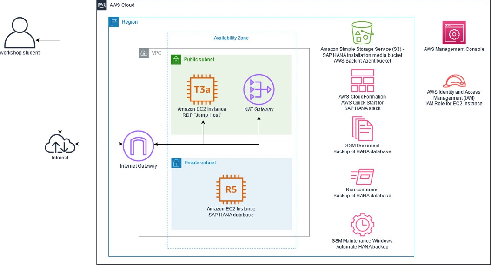

In the labs you will create a VPC, deploy a Windows RDP jump server and install SAP HANA Studio
Administration Console on that jump server. You will deploy an SAP HANA system using AWS Launch
Wizard for SAP and perform various tasks including database backups to Amazon S3 storage using AWS
Backint Agent.

## Your hosts

* Marcus Cebella, AWS Partner Trainer
* Paul Guy, AWS Sr. Partner Solutions Architect, SAP 
* Benjamin Houttuin, AWS Sr. Partner Solutions Architect, SAP
* Sourav Kumar Sadhu, AWS Partner Solution Architect, SAP
* Robert Paul, AWS Partner Solutions Architect, SAP

## Lab guide (main document to follow)

[https://basis-express-immersionday.workshop.aws/](https://basis-express-immersionday.workshop.aws/)

## AWS account

* [https://dashboard.eventengine.run/login](https://dashboard.eventengine.run/login)
* Event Hash: **6aed-1c2b2dd0f4-f4**
* Please use region **us-east-1 (North Virginia)** at all times.
* The temporary accounts are valid until: 2022-06-16 ~10:00 a.m. UTC
* Set a team name (this helps for the troubleshooting)

## S3 bucket for HANA installation media

* [s3://launchwizard-160656184270/saps4hana-2021/HANADB/](s3://launchwizard-160656184270/saps4hana-2021/HANADB/)

## Breakout rooms for questions and troubleshooting

We will use breakout rooms during the session to support.

## Additional information


*Target architecture of the lab*

## Additional information for the lab

### Login to lab environment

Click on the Lab Guide URL: [https://basis-express-immersionday.workshop.aws/](https://basis-express-immersionday.workshop.aws/)

Click *Prerequisites - AWS account “Event Engine“* tab to Login to lab your environment.

* Lab Environment login: [https://dashboard.eventengine.run/login](https://dashboard.eventengine.run/login)
* Use event hash: **6aed-1c2b2dd0f4-f4**
* Set a team name (this helps for the troubleshooting)
* Choose “Email One-Time Password (OTP)” and use your company email id (check your SPAM too) – this might take 1 or 2 minutes to arrive.
* Click **“AWS Console”** and then **"Open Console"** to access the AWS Console
* Download the default SSH Key *ee-default-keypair* (*.pem) at the first screen. 

 
### Lab 1: Getting started

Follow instructions in the lab guide. 
Click “Lab 1: Getting Started” and complete the below sections

* Task 1.1: Create a VPC
* Task 1.2: Create an IAM Role
* Task 1.3: Create an AWS Key Pair
    * Please make sure to use the **\*.pem** format.
* Task 1.4: Create Remote Desktop
* DO NOT perform Task 1.5: Download the installation media (*We have provided an S3 bucket with HANA software installation media already, as per notes below*)

 
### Lab 2: Deploy SAP HANA

Follow instructions in the lab guide. 
Click “Lab 2: Deploy SAP HANA” and complete the below sections.

* Task 2.1 - Option 1 – AWS Launch Wizard **(IMPORTANT NOTES)**
    * Optional: For Step 7 – you will need to create your own bucket – use this link [https://docs.aws.amazon.com/AmazonS3/latest/userguide/creating-bucket.html](https://docs.aws.amazon.com/AmazonS3/latest/userguide/creating-bucket.html), make sure to select region **“us-east-1 (N. Virginia)”**, name the bucket **"\<initials>-sc-\<random_number>"** so that the name is unique, and leave everything else default. Once you create, you will need to select the bucket.
    * For Step 20, point no. 4 use the following S3 URL *(including the concluding /)*: [s3://launchwizard-160656184270/saps4hana-2021/HANADB/](s3://launchwizard-160656184270/saps4hana-2021/HANADB/)
    * The deployment will take ~30 minutes to finish.
* Task 2.2: Install HANA Admin Console 
    * In case you can't C&P into the rendered RDP session, open this page and C&P locally.

```
echo "START"
$ErrorActionPreference = "Stop"
#
$mypath = "c:/eclipse2021-09"
If(!(test-path $mypath))
{
    New-Item -ItemType Directory -Force -Path $mypath
}
#
cd $mypath
# UNCOMMENT IN CASE NO JRE EXISTING
#echo "Downloading Amazon Corretto 11..."
#$url = "https://corretto.aws/downloads/latest/amazon-corretto-11-x64-windows-jdk.msi"
#$output = $mypath+"/amazon-corretto-11-x64-windows-jdk.msi"
#(New-Object System.Net.WebClient).DownloadFile($url, $output)
#echo "...done!"
#echo "Installing Amazon Corretto 11..."
#.\amazon-corretto-11-x64-windows-jdk.msi /qn /L* "install.log" /norestart ALLUSERS=2
#echo "...done!"
#
echo "Downloading Eclipse..."
$url = "https://www.eclipse.org/downloads/download.php?file=/technology/epp/downloads/release/2021-09/R/eclipse-java-2021-09-R-win32-x86_64.zip&r=1"
$output = $mypath+"/eclipse-java-2021-09-R-win32-x86_64.zip"
(New-Object System.Net.WebClient).DownloadFile($url, $output)
echo "...done!"
echo "Installing Eclipse..."
Expand-Archive -Path eclipse-java-2021-09-R-win32-x86_64.zip -DestinationPath $mypath
echo "...done!"
#
cd eclipse
#
dir
#
Start-Process -FilePath c:/eclipse2021-09/eclipse/eclipse.exe -ArgumentList "-nosplash -consoleLog -application org.eclipse.equinox.p2.director -repository https://tools.hana.ondemand.com/2021-09,http://download.eclipse.org/releases/2021-09 -installIU com.sap.ndb.studio.admin.feature.feature.group"
#
echo "Create Shortcut..."
#
$WshShell = New-Object -comObject WScript.Shell
$Shortcut = $WshShell.CreateShortcut("C:\Users\Public\Desktop\eclipse.lnk")
$Shortcut.TargetPath = $mypath+"/eclipse/eclipse.exe"
$Shortcut.Save()
#
echo "...done!"
#
echo "Installing SAP HANA Tools for Eclipse, please wait for new window to close! Closing here in 10 seconds!"
sleep 10

```

### Lab 3: Backup SAP HANA

*IMPORTANT:* First step is to create an Amazon S3 Bucket to store your HANA Backup. Refer to link: 
[https://docs.aws.amazon.com/AmazonS3/latest/userguide/creating-bucket.html](https://docs.aws.amazon.com/AmazonS3/latest/userguide/creating-bucket.html), make sure to select region **“us-east-1 (N. Virginia)”**, name the bucket **"\<initials>-bkp-\<random_number>"** so that the name is unique, and leave everything else default.

Click “Lab 3: Backup SAP HANA” and complete the below sections.

* Task 3.1: Backup to S3 via AWS Backint Agent
* Task 3.2: Managing AWS Backint Agent through HANA Studio
* Task 3.3: HANA Backup Automation
 
### Lab 4: Additional labs

Optional task - only perform if you are ahead of time

### Optional Labs

Optional task - only perform if you are ahead of time

### Very important points to note

Please follow the instructions for lab tasks listed in this supplement document and the online lab guide. 
When referring to online lab guide, please pay attention to all the details listed for each step in the online lab guide, and this supplement document.

Recommended web browsers:

* Latest three versions of Google Chrome, Mozilla Firefox or Microsoft Edge
* Latest two versions Apple Safari for macOS

 
Ensure that AWS region is **us-east-1 (North Virginia)** at all times, in the AWS management console. You can see it in the top right corner of the AWS Console.

You **DO NOT NEED** to download SAP HANA installation media (pre-requisite step 2 in the online lab guide) as this has already been downloaded for today’s lab.
 
You must specify the Amazon S3 bucket with HANA Software as **(including the final /)**: 

s3://launchwizard-160656184270/saps4hana-2021/HANADB/
 
Please complete the online survey after the Lab, we really value your feedback. The feedback request will be shared by T&C team. 

**Thank you!**
