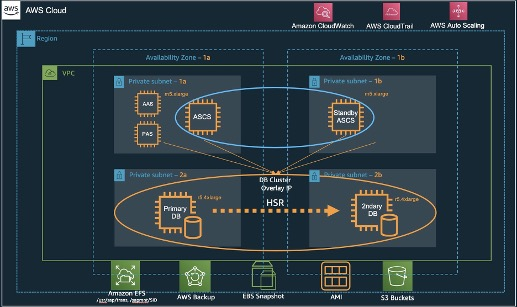
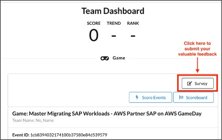

# About AWS GameDay

GameDay is a collaborative learning exercise that tests skills in implementing AWS solutions to solve real-world problems in a gamified, risk-free environment. This is a completely hands-on opportunity for technical professionals to explore AWS services, architecture patterns, best practices, and group cooperation.

The setting for every GameDay is our famous (fictitious) narrative. Participants are new hires at *Unicorn.Rentals* and this is their first day on the job.

# SAP GameDay
AWS-led fun and competitive full-day experience where participants troubleshoot and resolve unplanned outages to the SAP S/4HANA application.
 
## The Story 
A fictitious organization *Unicorn.Rentals* relies heavily on SAP to run their core enterprise. They use it to run core financials, sales, distribution, and HR. SAP is very critical to their rental business and if it is not available, there is a heavy revenue impact to the company. In short, if SAP is not available, customers cannot rent or return products and users cannot process business transactions. You’re tasked to maintain a resilient SAP system and expected to fix any issue that might arise during the day.

# Session information

## Main Session (Webex) 

[https://awsvirtual.webex.com/awsvirtual/j.php?MTID=m4aafbe87d6120b018c4f6258ae4de5b9](https://awsvirtual.webex.com/awsvirtual/j.php?MTID=m4aafbe87d6120b018c4f6258ae4de5b9)

* A headset is recommended or you may use your computer’s microphone and speakers.
* Pleae mute yourself while not actively speaking

## Support Session

* Amazon Chime will be used for individual support sessions. 
* Download Amazon Chime at [https://aws.amazon.com/chime/download](https://aws.amazon.com/chime/download)
* Breakout rooms (only for support & troubleshooting)
    * Room 1: [https://chime.aws/8104590035](https://chime.aws/8104590035)
    * Room 2: [https://chime.aws/1553952531](https://chime.aws/1553952531)
    * Room 3: [https://chime.aws/6255778433](https://chime.aws/6255778433)
    * Room 4: [https://chime.aws/9533943617](https://chime.aws/9533943617)
    * Room 5: [https://chime.aws/1438413717](https://chime.aws/1438413717)

# SAP Landscape Architecture for GameDay

*Architecture of the gameday environment*

The following VPC and Subnets are available in your environment.

| VPC                              |  Subnets                                       |  Usage           |
|-----                             |-----                                           |-----             |
|Unicorn-Rentals-HQ-SAP            |  Unicorn-Rentals-HQ-SAP\*                      |  Bastion hosts   |
|mod-\*-S4NewVPCHA-\*-VPCStack-\*  |  Private Subnet 1A/ 2A, Public Subnet 1/ 2    |  SAP landscape   |

Your SAP system constists of severeal instances listed below. You will also find two instances acting as bastion hosts.

|Name                       | Instance Type | Availability Zone | Security Group Name                                         |  
|---------------------------|-----------|---------------|---------------------------------------------------------------------|      
|HANA - HDB - Secondary     | r5.4xlarge|  us-east-1b   | mod-\*-SAPASCSStackSplitandEF-SecondaryInstance-\*-HANASecurityGroup-\*|     	
|StbySAPASCS                | r5.xlarge	|  us-east-1b   | mod-\*-SAPASCSStackSplitandEFS-\*-SAPASCSSecurityGroup-\*              |      
|HANA - HDB - Primary       | r5.4xlarge|  us-east-1a   | mod-\*-SAPASCSStackSplitandEFS-PrimaryInstance-\*-HANASecurityGroup-\* |       
|app1ascs00                 | r5.xlarge	|  us-east-1a   | mod-\*-SAPASCSStackSplitandEFS-\*-SAPASCSSecurityGroup-\*              |            
|app1pas00                  | r5.xlarge	|  us-east-1a	| mod-\*-SAPPASStackSplitandEFS-\*-SAPPASSecurityGroup-\*                |        
|app1aas00                  | r5.xlarge	|  us-east-1a	| mod-\*-SAPPASStackSplitandEFS-\*-SAPAASStack-*-SAPAASSecurityGroup-\*  |                    
|Unicorn-Rentals-HQ-SAP PC-1| t2.large  |  us-east-1a	| unicorn-sg                                                          |    
|Unicorn-Rentals-HQ-SAP PC-2| t2.large  |  us-east-1a	| unicorn-sg                                                          |        

# Game Play
All participants are expected to have **level 200-300 skills in SAP administration** and **level 100-200 skills in AWS cloud**

A series of random infrastructure and SAP related disruptions called **CHAOS** will be introduced to the SAP S/4HANA landscape. Participants have to diagnose the root cause and get users back online and connected to SAP to minimize impact. The built in disruptions are meant to simulate what could happen in an actual production SAP landscape. Participants who fix the disruptions are awarded points on the basis on numerous factors and move on to the next level with new **CHAOS** to happen. The participant with most points at the end wins the AWS SAP GameDay.

## Instructions

You’ll be introduced to 5 different **CHAOS** at different intervals. As soon as you identify and fix the issue, points would be awarded and you move on to the next level of the game and will be introduced to a new **CHAOS**. Each **CHAOS** is solved when you are able to log on to the SAP system using SAPlogon again. 

* Login to the SAP GameDay environment
    * Team Dashboard: [https://dashboard.eventengine.run/login](https://dashboard.eventengine.run/login)
    * Use Event Hash: **c193-1b69073794-d3**
    * Choose **Email One-Time Password (OTP)** and use your company email id which you used to register for the event (APN).
    * In the *Team Dashboard* click on **“Set Team Name”** and provide your team name.
    * Read the **README** carefully. This holds valuable information
    * Click **AWS Console** to open AWS Console
    * Check your **current score** on the score board

## First steps

* Once the first **CHAOS** has started (the instructor will let you know) get an overview about your AWS GameDay environment
* Find out what led to the unavailability of the SAP system
* Use all available information (README, this page, the AWS Console) to solve the issue and reestablish the connection to the SAP system via SAPlogon
* You may find useful information under *Score Events* on your *Team Dashboard* as well

Once you reach a certain score a new **CHAOS** level is triggered. This may take some minutes to take effect in your GameDay environment.

| &nbsp;  Chaos # &nbsp;    | &nbsp; Trigger Score  &nbsp; |
|:-------------------------:|:---------------------------:|
|             1             |            21000            |
|             2             |            23500            |
|             3             |            26000            |
|             4             |            28500            |
|             5             |            31000            |

# Feedback
Please complete the online SAP GameDay survey before you exit the event, your opinion matters. Responses are anonymous and are critical to help improve future event experiences.

*Where to find the survey*

# Useful Links

* AWS GameDay: [https://aws.amazon.com/gameday/](https://aws.amazon.com/gameday/)
* SAP on AWS: [https://aws.amazon.com/sap/](https://aws.amazon.com/sap/)
* SAP on AWS Blogs: [https://aws.amazon.com/blogs/awsforsap/](https://aws.amazon.com/blogs/awsforsap/)
* AWS SAP HANA Quick Start:	[https://aws.amazon.com/quickstart/architecture/sap-hana/](https://aws.amazon.com/quickstart/architecture/sap-hana/)

How to deploy SAP S/4HANA with High Availability using AWS Launch Wizard | Amazon Web Services:

[https://www.youtube.com/watch?v=0VyvrE2fvmc](https://www.youtube.com/watch?v=0VyvrE2fvmc)

SAP on AWS Partner Workshop Catalog and On-Demand Content:

[https://catalog.saponaws-partners.cloud/](https://catalog.saponaws-partners.cloud/)

AWS Certification Journeys: 

[https://pages.awscloud.com/GLOBAL_TRAINCERT_partner_emea_certification_journeys_20210916.html](https://pages.awscloud.com/GLOBAL_TRAINCERT_partner_emea_certification_journeys_20210916.html)

AWS upcoming Certification: SAP on AWS – Specialty:

[https://aws.amazon.com/certification/coming-soon/](https://aws.amazon.com/certification/coming-soon/)
