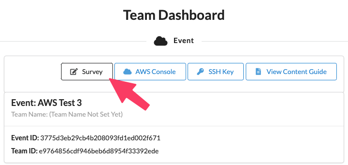
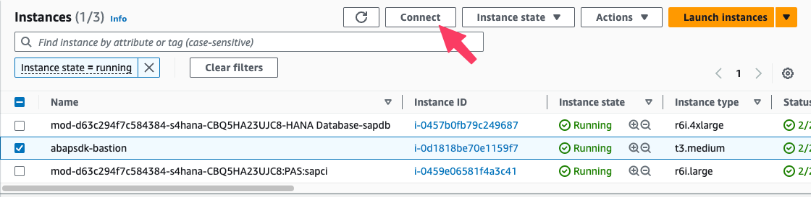
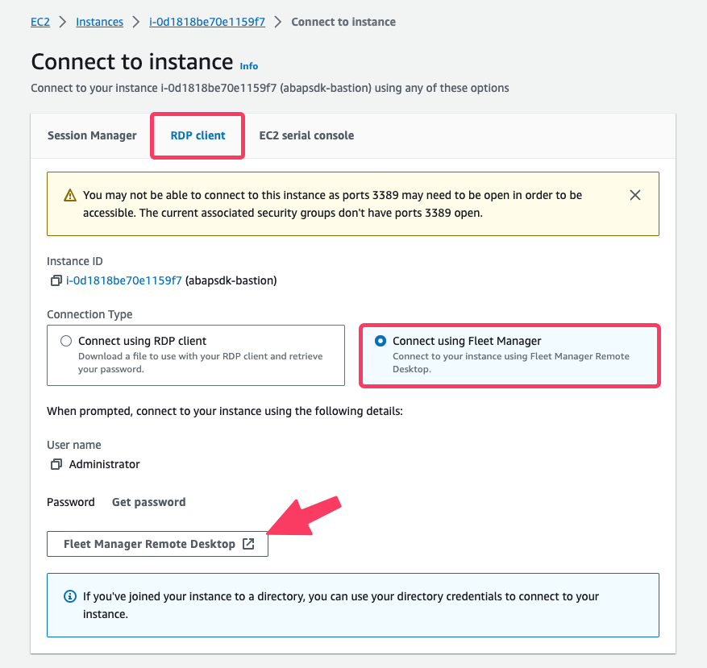
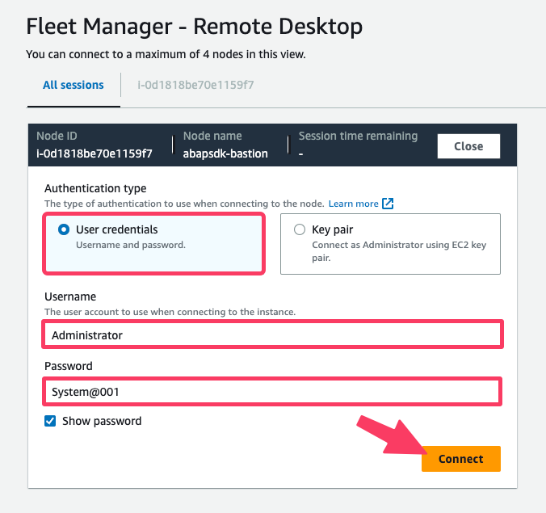
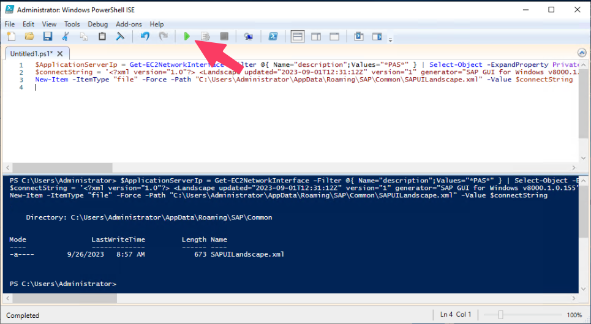
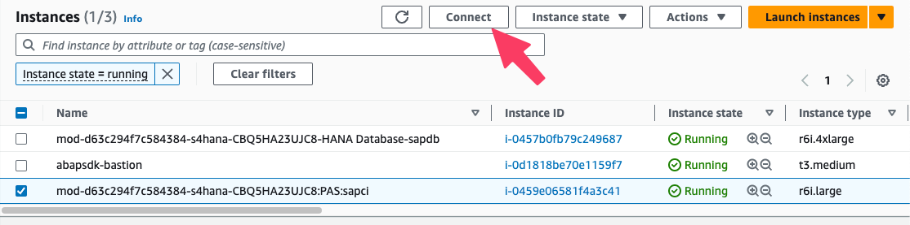
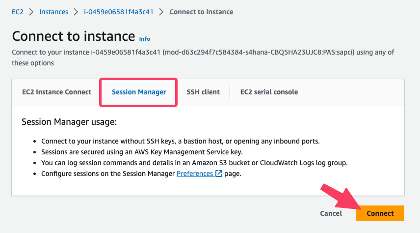
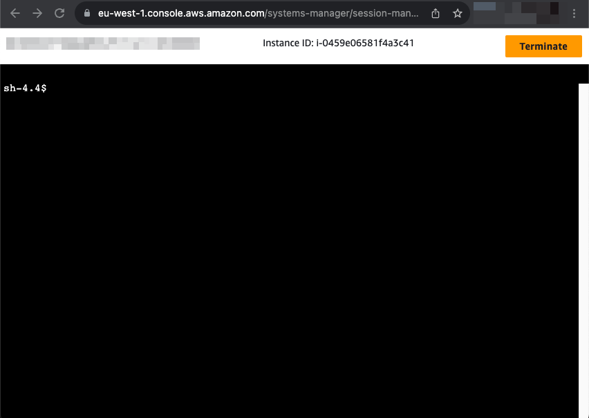

# Your hosts

* Himanshu Salathia, AWS Sr. Partner Solutions Architect, SAP
* Robert Paul, AWS Partner Solutions Architect, SAP

# Lab guide (main document to follow)

The lab guide is the main document for this workshop. This blog entry on the other hand will provide you with supplemental information where we need to differ from the lab guide.

[https://catalog.workshops.aws/abapsdk/en-US](https://catalog.workshops.aws/abapsdk/en-US)

# Login to your AWS demo account

* [https://dashboard.eventengine.run/login](https://dashboard.eventengine.run/login)
* Event Hash: **6aed-1c2b2dd0f4-f4**
* Please use region **eu-west-1 (Ireland)** at all times.
* The temporary accounts are valid until: 2023-09-28 ~8:00 p.m. CEST
* Set a team name (this helps for the troubleshooting)
* Choose “Email One-Time Password (OTP)” and use your company email id (check your SPAM too) – this might take 1 or 2 minutes to arrive.
* Click **“AWS Console”** and then **"Open Console"** to access the AWS Console

Recommended web browsers:

* Latest three versions of Google Chrome, Mozilla Firefox or Microsoft Edge
* Latest two versions Apple Safari for macOS
 
Please complete the online survey after the Lab, **we value your feedback.** 



# Breakout rooms for questions and troubleshooting

We will use breakout rooms during the session to support you individually. Reach out to us in the main chat in case you need some individual support.

# Additional information for the labs

We already prepared the SAP demo landscape for you to save the deployment time. As a result the documentation differs slightly from the demo environment. Please keep those things in mind reading the workshop documentation:

- AWS Region = **eu-west-1 (Ireland)**
- SAP System ID (SID) = **S4A**
- SAP Client = **000**
- SAP User = **DDIC** (you will create your own user later on)
- SAP Password for DDIC = **System@001**

## Lab00. Preparation

The SAP demo system was already preinstalled within the provided AWS demo account. No SAP CAL account is necessary for this workshop!

### Task01. Creating AWS IAM User

- Skip this task. No AWS IAM user to be used with SAP CAL has to be created. 

### Task02. Creating SAP demo system

- Skip this task. The SAP demo system has already been preinstalled for you.

## Lab01. Getting Started

Within this lab the AWS SDK for SAP ABAP will be installed and configured. Please read carefully as this lab differs from the workshop documentation.

### Information

You can use AWS Fleet Manager to connect to the bastion host "abapsdk-bastion" without opening ports for RDP to public. Follow these steps:








Next we need to create a SAPGui logon entry to connect to the SAP system. Follow these steps:

- Open "Windows PowerShell ISE"
- File - New
- Insert code snippet below and run it (it takes some time before the green play button becomes active)

```
$ApplicationServerIp = Get-EC2NetworkInterface -Filter @{ Name="description";Values="*PAS*" } | Select-Object -ExpandProperty PrivateIpAddress
$connectString = '<?xml version="1.0"?> <Landscape updated="2023-09-01T12:31:12Z" version="1" generator="SAP GUI for Windows v8000.1.0.155"><Includes><Include url="file:///C:/Users/Administrator/AppData/Roaming/SAP/Common/SAPUILandscapeGlobal.xml" index="0" description="SAP reserved"/></Includes><Workspaces><Workspace uuid="ed3d052c-d5e3-4534-bc61-da628173abaa" name="Local"><Item uuid="47762533-962c-4436-ab83-0e6b2cced6b8" serviceid="fe32d006-2925-4336-9711-d0e6d5985ee6"/></Workspace></Workspaces><Services><Service type="SAPGUI" uuid="fe32d006-2925-4336-9711-d0e6d5985ee6" name="Demo System" systemid="S4A" mode="1" server="' + $ApplicationServerIp + ':3212" sncop="-1" dcpg="2"/></Services></Landscape>'
New-Item -ItemType "file" -Force -Path "C:\Users\Administrator\AppData\Roaming\SAP\Common\SAPUILandscape.xml" -Value $connectString
``` 



Now we are able to logon to the SAP system.

- Open "SAP Logon 64"
- Logon to "Demo System" using: 
    - Client: 000
    - User: DDIC
    - Password: System@001 
    - **Hint: In some environments the "@" sign is not passed to the password field properly. Copy password from above and paste it into the password field**

Before we can install the AWS SDK for SAP ABAP, the SAP Transport Management System has to be configured. Please follow the steps below to configure the STMS. 

- Go to transaction: STMS
- Click "Save" on the "TMS: Configure Transport Domain" popup with default values
- Set password for TMSADM: **Aws1234567**
- "No default co. address" popup appears. Confirm and create demo company:
    - Company: **AWS**
    - Country: **DE**
    - Timezone: **CET**

After the configuration of the STMS proceed with **Lab01. Getting Started, Task01. IAM Admin**

### Task01. IAM Admin

- Skip: **"1. Create a policy of EC2 IAM role to download AWS SDK"**
- Do as described: **"2. Create an authorization to use AWS Services"**

### Task02. Basis Admin

#### "1. SAP prerequisiste"
    - Open the mentioned link from within the bastion host (use Internet Explorer and add the domain to the security exception list when asked)
    - Download the mentioned certificates using the PEM link
    - Go to transaction STRUST
    - Switch to "edit mode"
    - Right click on: "SSL client SSL Client (Standard)
    - Click on "Create" and confirm default values
    - Import Amazon Root Certs as described
    - Don't forget to click "Save" to persist settings

#### "2. ABAP SDK Installation"

As AWS SDK for SAP ABAP is already generally available we do not need to request access to it anymore. Todays demo environment differs from the workshop documentation. Please follow the steps below instead of the steps under "2. ABAP SDK Installation"

Connect to the EC2 Instance hosting the SAP NetWeaver Application Server
- Go to the running EC2 instances in AWS console
- Select EC2 instance "*:PAS:sapci" and click "Connect"



- Go to Session Manager and click "Connect". 



A SSH session within your browser will be opened.



- Switch to root user

```
sudo -i
```

- Create working directory

```
mkdir -p /usr/sap/downloads/abapsdk
```

- Download ABAP SDK Files

```
wget https://sdk-for-sapabap.aws.amazon.com/awsSdkSapabapV1/release/abapsdk-LATEST.zip -P /usr/sap/downloads/abapsdk/
```

- Unzip downloaded files

```
unzip /usr/sap/downloads/abapsdk/abapsdk-LATEST.zip -d /usr/sap/downloads/abapsdk/
```

- Move transport files to transport directories

```
find /usr/sap/downloads/abapsdk/transports/core -name 'R*AWS' -type f -exec mv {} /usr/sap/trans/data/ \;
find /usr/sap/downloads/abapsdk/transports/core -name 'K*AWS' -type f -exec mv {} /usr/sap/trans/cofiles/ \;

find /usr/sap/downloads/abapsdk/transports/xl8 -name 'R*AWS' -type f -exec mv {} /usr/sap/trans/data/ \;
find /usr/sap/downloads/abapsdk/transports/xl8 -name 'K*AWS' -type f -exec mv {} /usr/sap/trans/cofiles/ \;

find /usr/sap/downloads/abapsdk/transports/sns -name 'R*AWS' -type f -exec mv {} /usr/sap/trans/data/ \;
find /usr/sap/downloads/abapsdk/transports/sns -name 'K*AWS' -type f -exec mv {} /usr/sap/trans/cofiles/ \;

find /usr/sap/downloads/abapsdk/transports/tex -name 'R*AWS' -type f -exec mv {} /usr/sap/trans/data/ \;
find /usr/sap/downloads/abapsdk/transports/tex -name 'K*AWS' -type f -exec mv {} /usr/sap/trans/cofiles/ \;
```

- Set permissions to files

```
find /usr/sap/trans/data/ -name 'R*AWS' -type f -exec chmod 777 {} \;
find /usr/sap/trans/cofiles -name 'K*AWS' -type f -exec chmod 777 {} \;
```

- Add transports to buffer

```
su - s4aadm
/bin/bash
for name in /usr/sap/trans/cofiles/K*; do BASE=`basename $name | cut -f1 -d.`; tp addtobuffer AWS$BASE $SAPSYSTEMNAME client=000 pf=/usr/sap/trans/bin/TP_DOMAIN_S4A.PFL; done
```

- Import transports into SAP system

```
tp import all S4A client=000 pf=/usr/sap/trans/bin/TP_DOMAIN_S4A.PFL U04
```

The import of the transports can take up to 25 minutes. tp RC=8 is OK in this case.

#### Needed SAP system adjustments before proceeding

Before we can go ahead with the global and runtime settings we need to adjust our demo environment. This setting for client 000 has to be made for demo purposes only. In a real world scenarios client 000 would not be used for ABAP development.

- Allow changes for client specific objects
    - Go to transaction SCC4
    - Switch to edit mode
    - Double click on client 000
    - "Changes and Transports for Client-Specific Objects" set to "Automatic recording of changes"
    - Save

- Create a new user as a copy from DDIC to run through the demo
    - Go to transaction SU01
    - User: DDIC, click on Copy User
    - To: DEMOUSER
    - Set password to: Aws1234567
    - Save

- Login to the SAP GUI with the newly created user: DEMOUSER
    - When logging in set password to: Demo1234567


#### "3. Global and Runtime setting"

- Do as documented

### Task03. ABAP Developer

Run through as described but keep in mind that SAP System ID = **S4A**, SAP client = **000** and we are working in AWS region **eu-west-1**. Please replace the given values with those. 

## Lab02. [Amazon S3]

Please do this lab as described. As we do not have information in table **VBAK** we export an empty json-file to the S3 bucket mentioned. 

## Lab03. [Amazon SNS]

Please do this lab as described

## Lab04. [Amazon Textract]

Please do this lab as described

## Clean up resources

Skip this, the demo environment will be terminated automatically after the workshop
